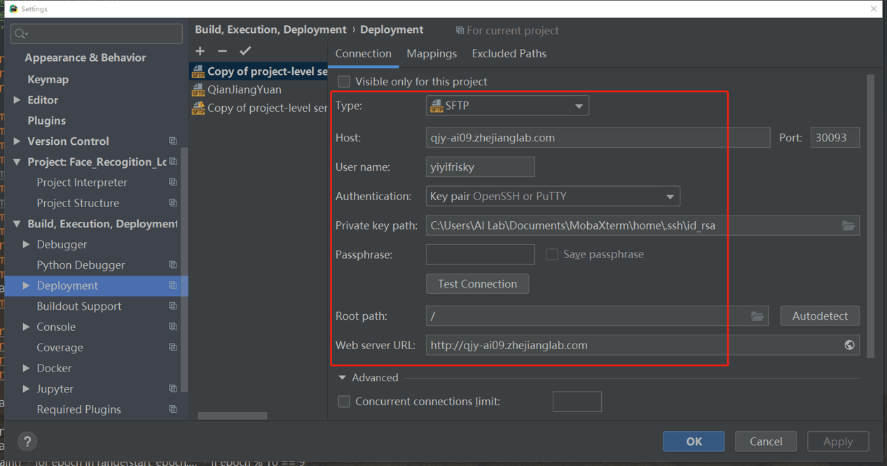
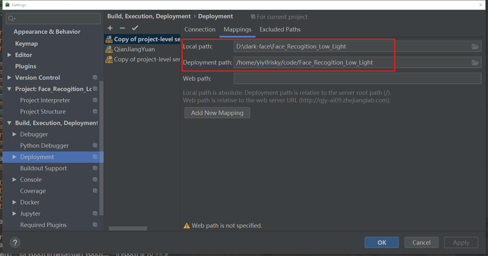
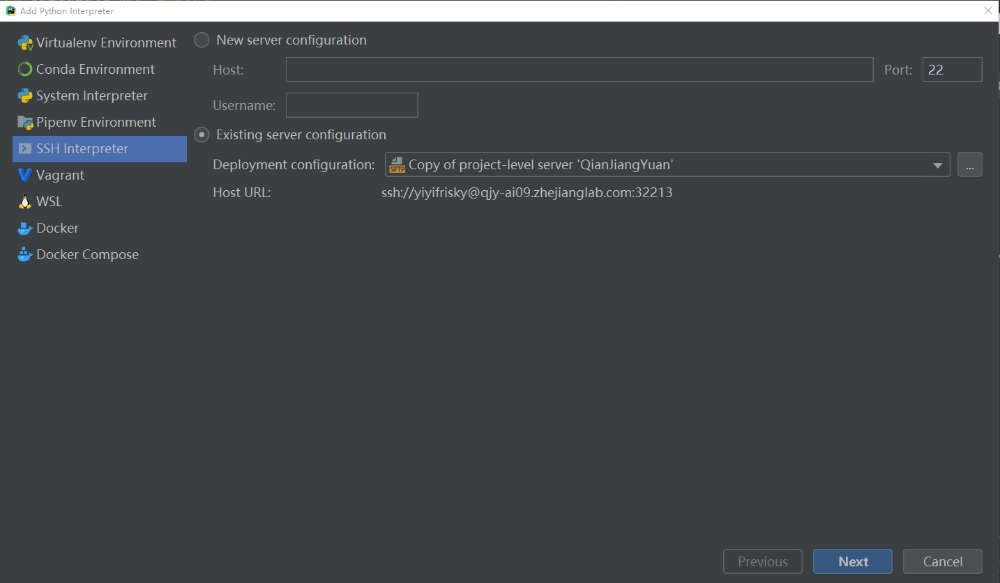
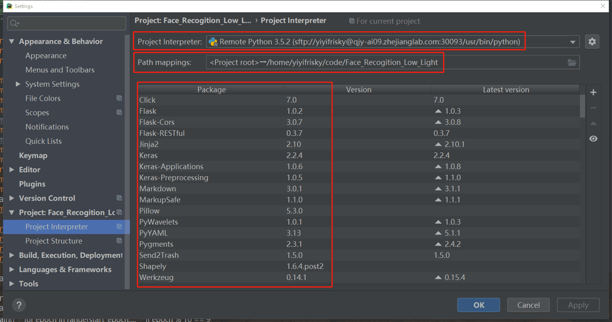
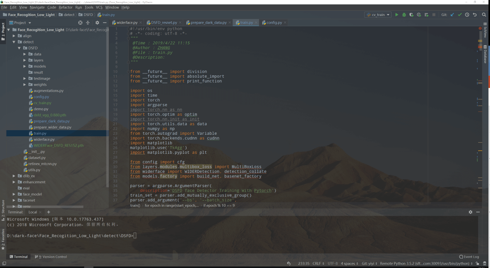

# 2.7: 使用技巧

### 用户可以通过PyCharm远程连接钱江源，从而实现在远程环境下运行本地代码。以下是配置PyCharm的使用方法。

- 打开PyCharm的files -> Settings -> deployment,点击 + ,选择connection，按照下图配置。（这里我使用了ssh key作为验证，用户也可以选择passphrase）配置好后点击Test Connection，如果显示连接成功，则进入下一步。

- 点击mappings，按照下图配置。文件路径分别是本地文件根目录和远程文件根目录。

- 打开project interpreter, 点击右边按钮选择Add，按照下图进行ssh配置。选择existing server configuration, 再选择之前给该配置起的名字。

- 在 path mapping中需要配置一下地址，确认本地root是map到远程对应的根目录。

- 点击apply，回到主界面。你就可以在本地修改代码，自动上传和更新代码到远程根目录。如同在本机操作一样方便。

## enjoy it :p
